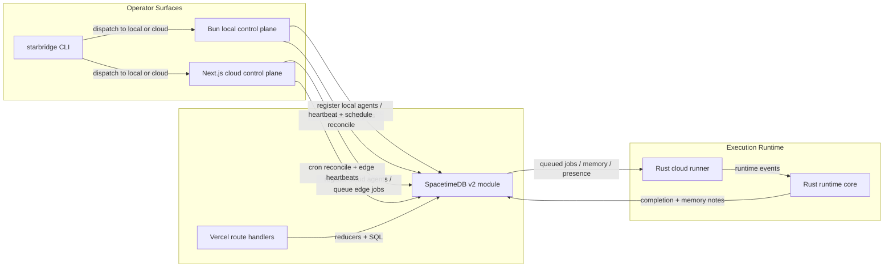

# Cadet Architecture

Starbridge takes the strongest reusable patterns from ElizaOS, Hermes, and OpenClaw, then re-centers them around a SpacetimeDB v2 control plane with two operator surfaces:

- a local Bun control plane for laptop-side agents
- a cloud Next.js control plane for Vercel, including an Edge-runtime dispatch path

Roadmap and decision docs:

- [Conversation synthesis](docs/CONVERSATION_SYNTHESIS.md)
- [RALPH loop](docs/RALPH_LOOP.md)
- [Implementation phases](IMPLEMENTATION_PHASES.md)
- [Session tracker](SESSION.md)
- [Master implementation plan](MASTER_IMPLEMENTATION_PLAN.md)
- [Docs index](docs/README.md)
- [Architecture guide](docs/ARCHITECTURE_GUIDE.md)
- [Dioxus + SpacetimeDB guide](docs/DIOXUS_SPACETIMEDB.md)
- [Agent manifests guide](docs/AGENT_MANIFESTS.md)
- [Dynamic agent UI](docs/DYNAMIC_AGENT_UI.md)
- [GitHub automation guide](docs/GITHUB_AUTOMATION.md)

## Canonical planning note

This file describes the architectural shape and high-level split.

The canonical execution sequence now lives in:

- `MASTER_IMPLEMENTATION_PLAN.md` for full phase ordering, review gates, and definition of done
- `IMPLEMENTATION_PHASES.md` for agent-friendly phase entry points and atomic loop execution
- `SESSION.md` for current checkpoint, next slice, and validated progress

Any agent continuing Cadet work should:

1. read `MASTER_IMPLEMENTATION_PLAN.md`
2. enter through `IMPLEMENTATION_PHASES.md`
3. use `docs/RALPH_LOOP.md` for slice size and proof discipline
4. update `SESSION.md` at each milestone handoff

## Design goals

- Character-style agent manifests with explicit tool and memory policy.
- A main CLI for local iteration and operator workflows.
- A Rust runtime core for execution correctness and a Rust runner for cloud agents.
- SpacetimeDB as the shared source of truth for agents, memory notes, jobs, and runner presence.
- Manifest-defined schedules and per-runner heartbeats stored in SpacetimeDB.
- A local control plane for local-runner agents.
- A cloud control plane for Vercel routes, cron-style wakeups, and edge-hosted agents.
- Event-driven execution boundaries so long-running work is handled by runners, not by polling from web routes.

## Topology

## Module boundaries

### `packages/core`

Shared TypeScript domain model:

- agent manifest validation
- deterministic job normalization
- prompt composition rules used by the CLI and control plane
- filesystem helpers for loading manifests
- schedule helpers for manifest-defined recurring work

### `packages/sdk`

Thin HTTP client for SpacetimeDB-backed control-plane operations:

- reducer invocation
- database schema checks
- SQL access when an operator surface needs read models
- shared registration flow for both local and cloud control planes
- schedule claims and public-table decoding for presence and schedules

### `packages/cli`

The main operator CLI:

- list agent manifests
- compose prompts locally
- dispatch jobs to either control plane

### `apps/local-control`

Local Bun service:

- local catalog from on-disk manifests
- local agent registration
- local-runner job dispatch
- local runner heartbeats
- local schedule reconcile loop plus manual `/schedules/reconcile`
- development parity with the cloud plane’s API shapes

### `rust/starbridge-core`

The execution kernel:

- typed runtime events
- tool policy projection
- prompt composition for runner-side enforcement
- event bus used by a future websocket or queue adapter

### `rust/starbridge-runner`

Cloud-execution unit:

- loads agent manifests
- composes run envelopes
- emits structured events
- ready to host a future SpacetimeDB subscription adapter

### `spacetimedb`

State machine and control data:

- agent registry
- job queue and lifecycle
- memory notes
- runner presence
- schedule registry and atomic scheduled-job claims

### `apps/web`

Vercel-ready control plane:

- `/api/catalog`
- `/api/agents/register`
- `/api/agents/edge/dispatch`
- `/api/jobs/dispatch`
- `/api/cron/reconcile`
- `/api/health`
- cloud scheduler heartbeat and stale-runner reconciliation

## Deployment shape

- Run `apps/local-control` for local agents and laptop-side orchestration.
- Deploy `apps/web` to Vercel with the project root set to `apps/web`.
- Add a Cloudflare Worker ingress surface against the same SpacetimeDB-backed workflow contracts when cross-edge deployment parity is needed.
- Run SpacetimeDB locally for development or publish the module to Maincloud.
- Run `starbridge-runner` as a local process for `local-runner` agents or as a container/VM sidecar for heavier stateful work.
- Treat Vercel cron as the cloud wakeup source and the Bun loop as the local wakeup source for scheduled tasks.

## Why this split

- Hermes contributes the three-tier CLI/core/backend separation and learning loop.
- OpenClaw contributes the gateway/control-plane mindset, cron hooks, and multi-surface operation.
- Eliza contributes manifest-driven agents, plugin-compatible extension points, and local-to-cloud packaging discipline.
- SpacetimeDB works best as the shared control fabric, while Vercel works best for stateless orchestration and edge-hosted lightweight agents, not for a permanently hot local-style loop.
