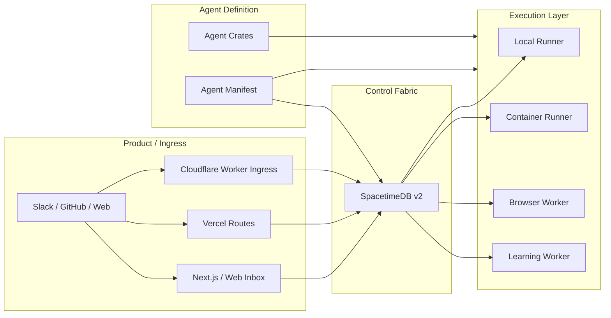

# Cadet Architecture Guide

Cadet is a deployment-agnostic agent system built around one rule:

> all durable agent state lives in SpacetimeDB, while execution happens in interchangeable runtimes.

This guide explains the full system shape, why each layer exists, and how new deployment targets or agent capabilities fit into the platform.

## 1. System overview

Cadet has four layers:

1. **Product / ingress layer**
   - Next.js web app
   - Vercel routes today
   - Cloudflare Worker ingress next
   - channel adapters such as web, Slack, and GitHub

2. **Control fabric**
   - SpacetimeDB v2 module
   - canonical workflow, browser, memory, approval, and delivery state

3. **Execution layer**
   - Rust workers
   - local runners
   - container runners
   - browser workers
   - learning workers

4. **Agent definition layer**
   - manifest-driven agents
   - typed tools
   - typed workflow templates
   - crate-based specialized execution modules

## 2. Why this architecture exists

Cadet is intentionally not:

- an ElizaOS runtime fork
- an OpenClaw clone
- a pure edge function agent
- a prompt-only manifest system

It takes specific strengths from those systems and replaces the parts that do not fit the target architecture:

- Eliza-style manifests and memory discipline
- Hermes-style operator speed and runtime separation
- OpenClaw-style product ambition and multi-surface reach

The replacement is:

- Rust for execution correctness
- SpacetimeDB for durable shared state
- vendor-neutral ingress adapters
- typed manifests and crate-based extensibility

## 3. Core architectural principles

### State is canonical

If a run, tool call, approval, browser action, or memory write matters, it belongs in SpacetimeDB.

### Execution is replaceable

Vercel, Cloudflare, and local/container workers can all participate because the real contract is the workflow state, not the process model.

### Agents are manifests plus code, not just prompts

The manifest decides:

- where the agent runs
- what tools it can use
- how browser access is constrained
- what workflow stages it prefers
- when it hands off
- how it learns

### Browser work is first-class

Browser tasks are durable work items with status, artifacts, and policy. They are not inline “best effort” side effects.

### Product and runtime are separate concerns

The web layer provides operator UX and channel ingress. The Rust workers provide long-lived execution.

## 4. Deployment topology

Cadet is designed to support the same state/workflow model across multiple targets.

### Local

Use when:

- iterating quickly
- debugging workers
- running private/dev agents
- using local browser capability

Pieces:

- `apps/local-control`
- `starbridge-runner --owner local-runner`
- `starbridge-runner --owner browser-worker`
- local SpacetimeDB or Maincloud

### Vercel

Use when:

- you want the operator-facing app
- you want fast ingress, cron, and UI hosting
- you want a product edge with minimal runtime overhead

Pieces:

- `apps/web`
- Vercel routes and cron
- optional Vercel AI Gateway / AI SDK usage for inference routing

Important:

- Vercel is not the durable worker runtime
- heavy execution must hand off to local/container/browser workers

### Cloudflare Workers

Use when:

- you want an alternative edge ingress
- you want the same durable workflow model on a different platform
- you want deployment parity across edge providers

Pieces:

- Worker ingress routes
- same shared SDK contracts
- same SpacetimeDB workflow/memory tables

Important:

- Cloudflare Workers are treated as another edge control surface, not as a special runtime model

### Self-hosted container cloud

Use when:

- you want long-running workers
- you need browser-heavy or compute-heavy execution
- you need private or custom infra

Pieces:

- `starbridge-runner` container
- browser worker container
- learning worker container

## 5. Data model overview

SpacetimeDB is the canonical model for:

- `agent_record`
- `thread_record`
- `message_event`
- `workflow_run`
- `workflow_step`
- `approval_request`
- `tool_call_record`
- `browser_task`
- `browser_artifact`
- `delivery_attempt`
- `memory_document`
- `memory_chunk`
- `memory_embedding`
- `retrieval_trace`
- `runner_presence`
- `schedule_record`
- `job_record` — queued and running job requests
- `memory_note` — simple key/value notes (legacy; prefer `memory_document` for RAG)
- `raw_message` — Layer 0: raw inbound payloads exactly as received
- `message_extraction` — Layer 1: structured entities, intents, sentiment extracted from messages
- `message_entity` — Layer 2: cross-channel entity identity graph
- `message_embedding` — Layer 3: vector representations for semantic message search
- `conversation_link` — cross-channel conversation mapping
- `message_route` — routing rules mapping channel patterns to target agents
- `trajectory_log` — TOON-encoded training data for SFT/RL self-improvement
- `operator_account` — registered human operators (WebAuthn passkeys)
- `webauthn_credential` — WebAuthn passkey credentials for operators
- `auth_challenge` — ephemeral WebAuthn challenges (auto-expired)

### What these tables mean

#### Threads and messages

- `thread_record` groups all user/channel conversation context
- `message_event` stores inbound, outbound, and system messages across web, Slack, GitHub, and later channels

#### Workflow

- `workflow_run` is one end-to-end execution
- `workflow_step` is one typed stage instance

Cadet’s canonical stages are:

- `route`
- `plan`
- `gather`
- `act`
- `verify`
- `summarize`
- `learn`

#### Browser execution

- `browser_task` stores requested browser work
- `browser_artifact` stores text, screenshots, PDFs, traces, and similar outputs

#### Memory

- `memory_document` stores the canonical durable source item
- `memory_chunk` stores retrieval units
- `memory_embedding` stores embedding metadata and vector payload
- `retrieval_trace` records which chunks were used for a run/step

#### Delivery and human-in-the-loop

- `delivery_attempt` stores outbound message attempts
- `approval_request` stores operator checkpoints

## 6. Workflow lifecycle

The durable lifecycle is:

1. ingress adapter receives a user or system event
2. Cadet creates or resumes a `thread_record`
3. Cadet writes a `message_event`
4. Cadet starts a `workflow_run`
5. Cadet enqueues the first `workflow_step`
6. a worker subscribes, claims, and executes the step
7. outputs are written back
8. the next step is enqueued
9. summary and learning stages close the run

This is why the system is deployment-agnostic. The ingress only needs to normalize input into the workflow fabric.

## 7. Worker roles

### `local-runner`

- local/private execution
- development workflows
- local CLI-adjacent agents

### `container-runner`

- durable heavy execution
- browser-heavy or longer-lived operations after edge triage

### `browser-worker`

- browsing
- extraction
- verification
- navigation and monitored sessions

### `learning-worker`

- post-run learning
- compaction
- summary creation
- embedding-backed memory writes

## 8. Browser architecture

Browser use is part of the platform contract, not an afterthought.

The manifest declares browser policy:

- enabled or not
- allowed and blocked domains
- concurrent session limits
- downloads allowed or not
- default mode
- approval-required modes

The workflow layer decides whether a step should hand off to `browser-worker`.

The browser worker:

- claims `browser_task`
- executes browsing or extraction
- stores artifacts
- returns a durable result back to the workflow

This means browser-backed agents work the same way whether the initial request came from:

- web UI
- Vercel
- Cloudflare Workers
- local CLI

## 9. Memory and retrieval architecture

Cadet uses a Spacetime-first semantic memory design.

### The rule

Keep canonical memory state inside Cadet’s own schema and retrieval API. Do not let a single provider or undocumented DB feature own the architecture.

### Memory flow

1. a run completes or produces a reusable artifact
2. Cadet writes a `memory_document`
3. it splits into `memory_chunk`
4. it stores `memory_embedding`
5. retrieval later returns chunk refs plus a `retrieval_trace`

This allows:

- agent-specific namespaces
- retrieval inspection
- learning policies
- future native vector search adoption without changing the public Cadet model

## 10. Channels and product layer

Cadet’s product layer should support:

- web chat
- operator inbox
- Slack
- GitHub
- later additional channels

The product goal is not just messaging. It is operator visibility:

- explain runs
- show browser artifacts
- show approvals
- retry or replay failed work
- expose per-agent dynamic dashboards

## 11. Agent crates vs plugins

Cadet should stay light.

Instead of a heavyweight plugin architecture, specialized agents should become crates/modules:

- coding agent crate
- browser research agent crate
- product/ops agent crate
- gaming agent crate

The manifest stays the source of truth, while the crate provides specialized execution logic behind the same typed contracts.

## 12. How to add a new deployment target

To add a new edge or ingress platform:

1. implement inbound event normalization
2. write `thread_record` / `message_event`
3. start `workflow_run`
4. enqueue the route step
5. reuse the same workers and shared SDK

Do not:

- fork the workflow schema
- create a platform-specific memory system
- move durable execution into the ingress runtime

## 13. Current architecture status

Already implemented:

- durable workflow schema (7 stages, full lifecycle)
- Rust subscription-driven workers (starbridge-runner)
- browser task model (enqueue/claim/complete/fail + artifacts)
- semantic memory tables and retrieval trace storage (document/chunk/embedding/trace)
- web inbox and run detail pages (Next.js 16 dashboard)
- Vercel-ready control plane (cloud + local dual-plane)
- 3-layer message bus: raw ingest, extraction, entity identity graph
- WebAuthn passkey authentication (operator accounts)
- TOON prompt builder (~40% fewer tokens, priority-ordered, budget-fitted)
- Multi-agent subscription system (shared inbox + per-agent SQL filters)
- Chat SDK integration (Slack, Discord, Telegram, GitHub adapters)
- 30 agent tools across 7 categories (direct API, no MCP)
- Trajectory logging for SFT/RL training data

Planned next:

- Cloudflare Worker ingress parity
- dynamic agent UI from manifest-backed catalogs
- crate-based specialized agents

## 14. Related docs

- [Docs index](README.md)
- [Prompt system](PROMPT_SYSTEM.md) — TOON encoding, token budgets, TS bridge
- [Subscription system](SUBSCRIPTION_SYSTEM.md) — SpacetimeDB multi-agent subscriptions
- [API routes](API_ROUTES.md) — 20 HTTP endpoints
- [Tools reference](TOOLS_REFERENCE.md) — 30 agent tools
- [Conversation synthesis](CONVERSATION_SYNTHESIS.md)
- [Agent manifests guide](AGENT_MANIFESTS.md)
- [Dynamic agent UI](DYNAMIC_AGENT_UI.md)
- [GitHub automation guide](GITHUB_AUTOMATION.md)
- [RALPH loop](RALPH_LOOP.md)
- [Implementation phases](../IMPLEMENTATION_PHASES.md)
- [Contributing](../CONTRIBUTING.md)
